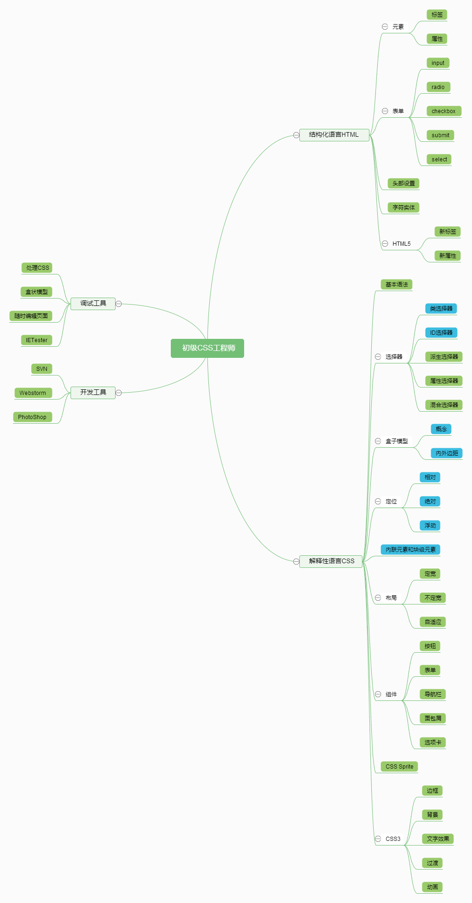

IT修真院CSS一级task01-15
=============================
###Task的整体设置如下：
* 1~3           搭建基础环境，学会Nginx，WebStorm，Svn/git,linux Shell，dns/dnspod
* 4~6           学会和UI的交互，学会切图和制作雪碧图，了解如何从静态图片变成静态网页的过程，掌握一些基本的切图技巧和布局知识，布局，定位，浮动等。
* 7~9           掌握常见的WEB布局和一些常见的CSS效果
* 10~12       学会自适应和响应式，熟悉长度单位，以及更多的Html控件
* 13~15       使用less和Bootstrap

###通过本系列任务，可以掌握以下内容。

